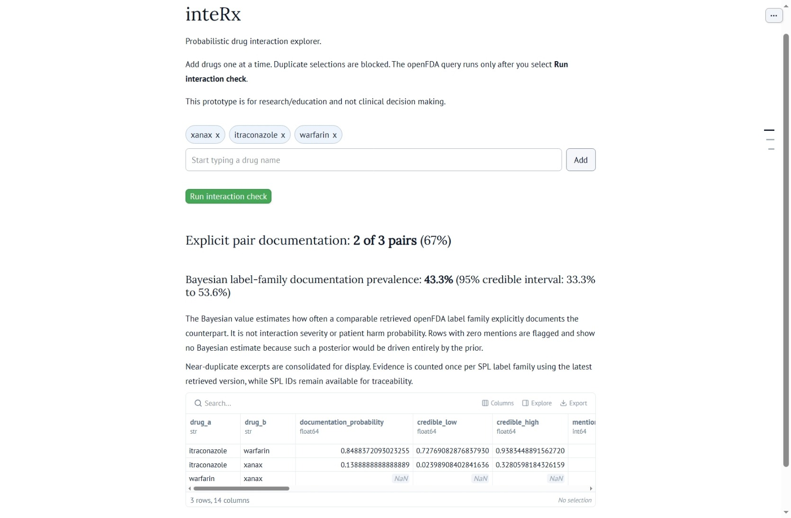

# inteRx

inteRx is a Marimo-based probabilistic drug-interaction explorer for research and education. It accepts generic or brand drug names, resolves label names through openFDA, checks every unique selected pair against FDA Structured Product Labeling (SPL) interaction text, and presents evidence-backed pairwise results with source links and uncertainty estimates.

Hosted as a [molab-wasm-page](https://molab.marimo.io/github//fuzzyLife/inteRx/blob/master/app.py/wasm).



> **Important:** inteRx is not a clinical decision-support tool. It must not be used to prescribe, stop, or change medication. A missing interaction result does not mean that a combination is safe.

## Run the app

The notebook declares its Python dependencies inline. With `uv` installed, run this command from the directory containing `app.py`:

```bash
uv run marimo run app.py
```

Marimo creates an isolated environment when requested, starts a local server, and prints the browser URL, typically:

```text
Running app.py
URL: http://localhost:2718
```

## Using the drug picker

The original comma-separated text box and later multiselect prototypes were replaced with a custom token-style autocomplete built with `anywidget` and `traitlets`.

1. Start typing a generic or brand name.
2. Choose a suggestion and press Enter, or select **Add**.
3. The selected drug becomes a removable chip.
4. The input clears and receives focus for the next drug.
5. Duplicate selections are blocked.
6. Select **Run interaction check** after choosing at least two distinct drugs.

The separate run button is intentional. It prevents the openFDA queries from running after every edit. The picker is not wrapped in a Marimo form because Marimo forms clone their wrapped element, while an `anywidget` instance cannot be deep-copied.

Examples available through the derived vocabulary include:

```text
aspirin
warfarin
alprazolam
xanax
xanax xr
itraconazole
```

## What `app.py` does

### Self-contained WASM vocabulary

`app.py` embeds `openfda_drug_choices` directly so the hosted WASM app does not need to import a generated Python module or read an external vocabulary file at runtime. The source list can be regenerated and replaced automatically by `buildInteractionDrugVocabulary.py`.

### Brand and generic name handling

For every submitted name, the app queries the openFDA drug-label endpoint using supported `search` and `limit` parameters against:

```text
openfda.brand_name
openfda.generic_name
```

Returned labels are filtered locally to retain labels whose normalized brand, generic, or substance names match the submitted name. This preserves familiar selections such as `xanax` while allowing interaction text to be matched through related ingredient names such as `alprazolam`.

### Interaction evidence

The app:

- Generates every unique pair from the submitted drugs.
- Reads the `drug_interactions` sections of matching labels.
- Checks both directions for each pair because one drug's label may mention the other even when the reverse label does not.
- Adds evidence only when the counterpart or a resolved label alias is explicitly named in the interaction text.
- Extracts the matching sentence or excerpt into the `harm` column.
- Keeps pairs without an explicit label co-mention and marks them as unknown rather than safe.
- Adds an SPL-specific openFDA query URL in `source_url` for evidence-backed results.
- Consolidates unique label excerpts and evidence into one result per drug pair.

The openFDA drug-label endpoint returns label records, not a validated pairwise interaction-checker result. inteRx performs the pair comparison locally.

See the [openFDA drug-label endpoint documentation](https://open.fda.gov/apis/drug/label/how-to-use-the-endpoint/) and [openFDA query parameter reference](https://open.fda.gov/apis/query-parameters/).

## Bayesian scoring

Each pair starts with a conservative `Beta(1, 9)` prior. Evidence rows update that prior using source and row weights. The app reports:

- Posterior mean probability for each evidence-backed pair.
- A 95% credible interval for each pair.
- Evidence count, evidence identifiers, source type, and source URL.

For combinations containing multiple evidence-backed pairs, the app samples from the pair-level posteriors and applies noisy-OR aggregation. This propagates pair-level uncertainty into the combined estimate instead of multiplying fixed point estimates.

The source weights and prior are modeling defaults. They are not clinically validated probabilities.

## Optional external evidence

The current app retains support for an optional reviewed evidence CSV through the `INTERACTION_EVIDENCE` environment variable. The expected columns are:

```text
drug_a,drug_b,harm,source,evidence_id,positive,negative,weight,url
```

Example:

```bash
INTERACTION_EVIDENCE=/path/to/reviewed_evidence.csv uv run marimo run app.py
```

Only use evidence that you are authorized to access. Validate the evidence, terminology, and calibration before using it in any workflow.

## Building the drug vocabulary

### Why `buildInteractionDrugVocabulary.py` exists

The first vocabulary was based too narrowly on names from labels that themselves contained a `drug_interactions` section. That excluded valid interaction entities such as `aspirin`: a standalone aspirin label may not provide the required section, while a warfarin label can still explicitly mention aspirin.

Splitting product names at the first non-alphanumeric character was also rejected. That approach could create invalid entities such as `wixela` from `Wixela Inhub`. The final approach derives canonical interaction names and brand aliases from openFDA label relationships instead of guessing names from string fragments.

### Derivation pipeline

`buildInteractionDrugVocabulary.py` performs a two-pass build over the openFDA bulk drug-label partitions.

#### Pass 1: collect candidate entities

The builder:

- Downloads the current drug-label partition manifest and all listed ZIP partitions.
- Collects normalized `generic_name` and `substance_name` values from every label, not only labels containing interaction sections.
- Rejects placeholders, strengths, dosage forms, unsupported punctuation, combination strings, formulation descriptions, and selected biologic suffix variants.
- Collects usable brand names and links each brand to clean canonical candidates found on the same label.

This allows `aspirin` to be discovered from openFDA data without manually inserting it.

#### Pass 2: scan interaction text

The builder then:

- Scans all available `drug_interactions` sections.
- Retains canonical candidates that are explicitly mentioned in interaction text.
- Counts total mentions and distinct labels containing each mention.
- Retains a brand only when its label relationship connects it to a retained canonical interaction name.

For example, `xanax` is retained as a derived brand alias connected to `alprazolam`. Neither `aspirin` nor `xanax` is manually added to the final list.

### Generated outputs

Run:

```bash
python3 buildInteractionDrugVocabulary.py
```

The builder writes:

```text
openfda_interaction_drugs.csv
openfda_drug_choices.csv
openfda_interaction_drugs.py
openfda_interaction_drugs.txt
openfda_drug_choices.txt
openfda_interaction_drugs_rejected.csv
```

The generated Python module contains:

```text
OPENFDA_INTERACTION_DRUGS
OPENFDA_INTERACTION_DRUG_SET
OPENFDA_BRAND_ALIAS_MAP
OPENFDA_DRUG_CHOICES
OPENFDA_DRUG_CHOICE_SET
```

The CSV outputs provide an audit trail for canonical names, brand aliases, source-label counts, interaction-text mentions, and rejected candidates.

### Automatic update of `app.py`

After deriving `drug_choices`, the builder looks for a literal assignment named:

```python
openfda_drug_choices = (
    # embedded values
)
```

The builder uses Python's AST to locate that assignment and replaces only the tuple. It then parses and compiles the updated source before atomically replacing `app.py` through a temporary file.

By default, the builder updates `app.py` in the current directory. To update another file:

```bash
INTERX_APP_PATH=/path/to/app.py python3 buildInteractionDrugVocabulary.py
```

If the target file does not exist or the assignment is absent, the builder reports that the app update was skipped instead of rewriting unrelated code.

### Derivation checks

The builder requires these representative entities to be derived from openFDA data:

```text
aspirin
warfarin
alprazolam
xanax
```

Expected classifications include:

```text
aspirin: canonical
alprazolam: canonical
warfarin: canonical
xanax: brand -> alprazolam
```

A missing required entity stops the build so a regression cannot silently remove these common selections.

## Limitations

- Label co-mention does not establish causality, severity, dose dependence, or patient-specific risk.
- A label may use an ingredient, class, abbreviation, salt, or synonym that is not captured by the available aliases.
- A missing label co-mention does not mean the combination is safe.
- openFDA data may be incomplete, duplicated, delayed, or inconsistently normalized.
- The generated vocabulary is designed for interaction-text discovery, not as a complete drug terminology or prescribing database.
- The Bayesian prior, evidence weights, and noisy-OR aggregation are exploratory defaults rather than validated clinical calibration.
- FDA and openFDA advise against relying on openFDA data alone for medical-care decisions.

## Demo

A 1:46 public demo video explains the evidence pipeline, Bayesian aggregation, the earlier Codex implementation work, and GPT-5.6 Luna Light's role in the project: [watch on YouTube](https://www.youtube.com/watch?v=a0pYnpxZgTw).

## Credits and development history

Earlier development was carried out with Codex and GPT-5.6 Luna Light. Codex implemented and validated earlier Marimo, openFDA, Bayesian, documentation, and demo changes. GPT-5.6 Luna Light was used by the project owner for design direction and narration context.

| Prompt or request | Codex response |
| --- | --- |
| Create a Marimo notebook for probabilistic drug-interaction exploration. | Created the initial `app.py` Marimo prototype with drug entry, pair detection, a demo dataset, and a combined score. |
| Replace the hardcoded interaction database with literature-derived evidence and Bayesian aggregation. | Removed the hardcoded table, added the normalized optional evidence CSV interface, source weighting, Beta posterior estimates, credible intervals, and uncertainty-aware noisy-OR aggregation. |
| Create a public YouTube-ready demo video that explains the build, Codex, and GPT-5.6. | Produced and validated a 1:46, 1920x1080 H.264/AAC MP4 with narration and a research-only disclaimer; the published video is linked above. |
| Use openFDA label data instead of a CSV column for FDA evidence. | Added live openFDA label lookups and converted explicit `drug_interactions` co-mentions into FDA evidence rows. |
| Fix the openFDA request and the empty-evidence error. | Removed the unsupported `fields` parameter, used documented `search` and `limit` parameters, added concise network errors, and preserved the empty DataFrame schema. |
| Expand the app to multiple drugs and show exact source links. | Added all unique-pair generation and the `source_url` column with an SPL-specific openFDA query link. |
| Extract the exact interaction in the `harm` column. | Added sentence-level extraction from the relevant FDA label section and placed it after the drug-pair columns. |
| Merge multiple rows for the same pair. | Consolidated unique label excerpts and evidence into one table row and one posterior per drug pair. |
| Update the README. | Replaced the prototype notes with current setup, architecture, source, scoring, limitations, demo, and attribution documentation. |

GPT-5.6 reasoning model, assisted with the work documented in this update. That work included diagnosing vocabulary omissions, identifying why `aspirin` was excluded, restoring brand-name choices such as `xanax`, designing and validating the token-style autocomplete interaction, separating selection from query execution, resolving the Marimo `anywidget` form cloning failure, building the two-pass vocabulary derivation workflow, adding AST-based automatic embedding into `app.py`, and updating this README. The project owner tested the application locally and directed each design correction.

The project owner selected the data source, product scope, interaction examples, hosting constraints, and final design decisions.

### Session development log

- Replaced the comma-separated text area with suggestion-based drug selection.
- Rejected the multiselect interface because it exposed an impractical **Select all** action and did not return focus to search after selection.
- Rejected multiple independent dropdowns because they allowed duplicate choices and imposed a fixed number of drugs.
- Added a custom `anywidget` token picker with suggestions, removable chips, duplicate prevention, input clearing, and automatic refocusing.
- Added a separate **Run interaction check** button so network queries execute only after selection is complete.
- Removed the attempted `.form()` wrapper after Marimo raised `NotImplementedError: Widgets cannot be copied`; `mo.ui.run_button` now gates execution without cloning the widget.
- Embedded the autocomplete vocabulary directly in `app.py` for WASM deployment.
- Restored generic and brand-name openFDA lookup and label-alias matching.
- Added bidirectional pair inspection and retained visible interaction excerpts, evidence identifiers, source URLs, pair probabilities, and credible intervals.
- Investigated missing `aspirin` and found that collecting candidates only from labels with interaction sections was too restrictive.
- Reworked vocabulary generation to collect generic and substance candidates from all labels, then retain candidates mentioned in interaction text.
- Derived brand aliases from label relationships, including `xanax -> alprazolam`.
- Added auditable generated outputs and required regression checks for aspirin, warfarin, alprazolam, and Xanax.
- Added AST-based replacement of the embedded `openfda_drug_choices` tuple in `app.py`.

## License and responsibility

Review the repository license before reuse. Users are responsible for validating data rights, medical terminology, model assumptions, and all outputs. Do not use inteRx as the sole basis for medical decisions.
