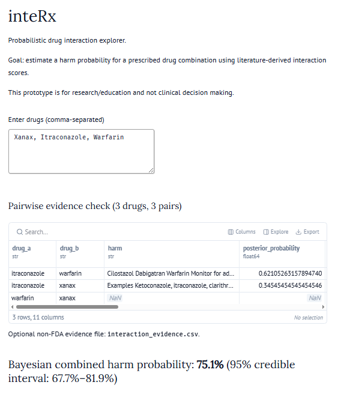

# inteRx

`inteRx` is a Marimo-based, probabilistic drug-interaction explorer for
research and education. It accepts a comma-separated list of drugs, checks
every unique drug pair against FDA Structured Product Labeling (SPL) text via
openFDA, and presents evidence-backed pairwise results with source links.

Hosted as [molab-wasm-page](https://molab.marimo.io/github//fuzzyLife/inteRx/blob/master/app.py/wasm)



NOTE: It is not a clinical decision-support tool and must not be used to prescribe,
stop, or change medication. This is PURELY for information purposes ONLY!

## Run the notebook

The notebook declares its Python dependencies inline. With `uv` installed,
run it from the directory containing `app.py`: for serving locally try
```
uv run marimo run app.py 

        Running app.py ⚡

        ➜  URL: http://localhost:2718
```         
Marimo starts a local server and prints the browser URL. Enter two or more
drug names, separated by commas; all unique pairs are checked. For example,
`Xanax, Itraconazole, Warfarin` produces three candidate pairs.

## What the notebook does

1. Searches openFDA's drug-label endpoint separately for each entered name as
   both `openfda.brand_name` and `openfda.generic_name`.
2. Reads the returned `drug_interactions` label sections. openFDA does not
   provide a validated pairwise interaction-checker endpoint.
3. Adds evidence only when an entered counterpart is explicitly named in the
   label text. Missing mentions are treated as unknown, never as evidence that
   the pair is safe.
4. Extracts the sentence that names the paired drug and displays it in the
   `harm` column, immediately after `drug_a` and `drug_b`.
5. Shows every candidate pair, including pairs without a label co-mention.
6. Adds an exact openFDA SPL query URL in `source_url` for each evidence-backed
   result.
7. Merges all unique label excerpts for the same pair into one row and computes
   one posterior probability per pair.

The API calls use only supported openFDA query parameters: `search` and
`limit`. The endpoint returns full label records; the notebook extracts the
needed sections locally. See the [openFDA drug-label documentation](https://open.fda.gov/apis/drug/label/how-to-use-the-endpoint/) and [query parameter reference](https://open.fda.gov/apis/query-parameters/).

## Bayesian scoring

Each pair starts with a conservative Beta prior, `Beta(1, 9)`. Evidence rows
update that prior with weighted positive and negative observations. The app
reports the posterior mean and a 95% credible interval for each pair.

For a combination with evidence-backed pairs, it samples each pair's posterior
and applies noisy-OR aggregation. This carries pair-level uncertainty into the
combined harm estimate instead of multiplying fixed probabilities. Source
weights are configurable in `app.py` and are defaults, not validated clinical
calibration.

## Optional external evidence

Set `INTERACTION_EVIDENCE` to a CSV path to add reviewed exports from licensed
DrugBank data, PubMed studies, or pharmacovigilance datasets. The CSV requires
these columns:

```text
drug_a,drug_b,harm,source,evidence_id,positive,negative,weight,url
```

The app normalizes drug-pair order and combines this evidence with the live FDA
label evidence. Use only data you are authorized to access and validate the
evidence, terminology, and calibration before any clinical workflow.

## Limitations

- Label co-mention does not establish causality, severity, dose dependence, or
  the probability of patient harm.
- A label may use an ingredient, drug class, abbreviation, or brand name that
  does not exactly match the entered text.
- A missing label co-mention does not mean the combination is safe.
- DrugBank licensing and access restrictions apply; the notebook does not
  scrape or invent DrugBank probabilities.
- FDA and openFDA explicitly advise against relying on openFDA data alone for
  medical-care decisions.

## Demo

A 1:46 public demo video explains the evidence pipeline, Bayesian aggregation,
the Codex implementation work, and GPT-5.6 Luna Light's role in the project:
[watch on YouTube](https://www.youtube.com/watch?v=a0pYnpxZgTw).

## Credits and development log

This prototype was developed collaboratively by the project owner, Codex, and
GPT-5.6 Luna Light. Codex inspected the existing Marimo app, implemented and
validated the code changes, documented the project, and prepared the demo
assets. GPT-5.6 Luna Light was used by the project owner for design direction
and narration context. The project owner selected the sources, product scope,
and final presentation decisions.

| Prompt or request | Codex response |
| --- | --- |
| Create a Marimo notebook for probabilistic drug-interaction exploration. | Created the initial `app.py` Marimo prototype with drug entry, pair detection, a demo dataset, and a combined score. |
| Replace the hardcoded interaction database with literature-derived evidence and Bayesian aggregation. | Removed the hardcoded table, added the normalized optional evidence CSV interface, source weighting, Beta posterior estimates, credible intervals, and uncertainty-aware noisy-OR aggregation. |
| Create a public YouTube-ready demo video that explains the build, Codex, and GPT-5.6. | Produced and validated a 1:46, 1920x1080 H.264/AAC MP4 with narration and a research-only disclaimer; the published video is linked above. |
| Use openFDA label data instead of a CSV column for FDA evidence. | Added live openFDA label lookups and converted explicit `drug_interactions` co-mentions into FDA evidence rows. |
| Fix the openFDA request and the empty-evidence error. | Removed the unsupported `fields` parameter, used documented `search` and `limit` parameters, added concise network errors, and preserved the empty DataFrame schema. |
| Expand the app to multiple drugs and show exact source links. | Added all unique-pair generation and the `source_url` column with an SPL-specific openFDA query link. |
| Extract the exact interaction in the `harm` column. | Added sentence-level extraction from the relevant FDA label section and placed it after the drug-pair columns. |
| Merge multiple rows for the same pair. | Consolidated unique label excerpts and evidence into one table row and one posterior per drug pair. |
| Update the README. | Replaced the prototype notes with current setup, architecture, source, scoring, limitations, demo, and attribution documentation. |
